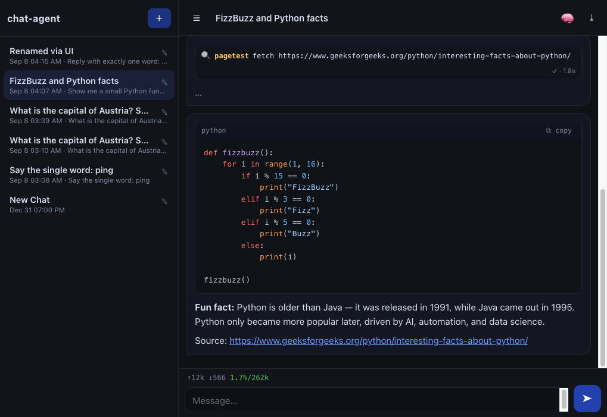
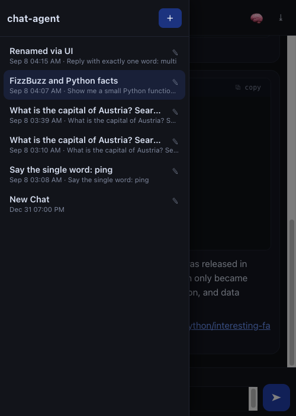
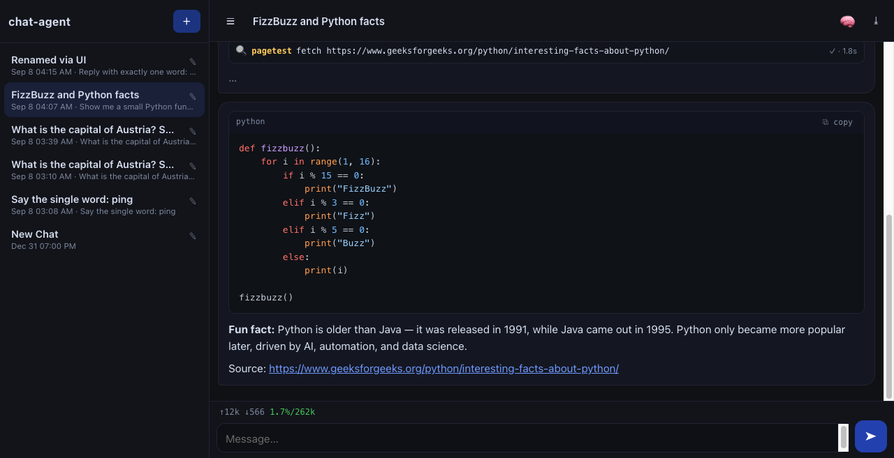

# 🤖 chat-agent — 📱 mobile AI chat on your local network

A mobile-first AI chat that runs **entirely on your LAN**: a Node.js backend
serves the web app over **HTTPS** (Caddy TLS), talks to a local
OpenAI-compatible LLM — `qwen-3.8b-256k` from `~/.pi/agent/models.json`
(provider `s2-qwen-3.8-256k` @ `http://spark-two:8000/v1`) — and lets the agent
search the real web through the `page-test` browser daemon. No accounts, no
cloud, no data leaving the network. 🏠



## ✨ What you get

- 💬 **Streaming chat** on a small local model — answers appear token by token
- 🔍 **Real web search** — the agent drives a live Chrome tab (Brave, Google,
  DuckDuckGo, Wikipedia, Google Images) and answers with cited sources
- 🧠 **Thinking mode toggle** — per conversation: reason first, or answer directly
- 📋 **Copy button on every turn** — and on every code block
- 🎨 **Syntax highlighting** for code blocks (highlight.js, self-hosted)
- 📊 **Usage stats line** — `↑12k ↓566 1.7%/262k`: tokens in, tokens out,
  context fill (green → white → yellow → red as it fills)
- 🗂️ **Collapsible chat list** — rename ✎, ＋ New (each chat gets its own
  `/chat/<uuid>` URL, so the browser back button works)
- ⤓ **One-tap markdown export** in the format of `/volumes/DATA/conversations`
- 🔔 **Mobile notifications without any cloud** — a service worker holds its
  own websocket and pops an OS notification when an answer lands while you're
  in another app
- 📲 **Multi-device** — every tab, service worker and phone on the LAN can
  connect at once; events broadcast to all of them




## 🚀 Quick start

Requirements: Node.js ≥ 22, [Caddy](https://caddyserver.com) in PATH, the
`page-test` CLI installed, and `~/.pi/agent/models.json` (or set
`MODELS_JSON`).

```bash
npm install
sh scripts/cert.sh                 # issue the local leaf cert (Caddy's internal CA)
npm run start:all                  # node API + edge + Caddy TLS
```

Then open **`https://<host-ip>:4242/`** from the phone or desktop browser on
the same LAN (`ipconfig getifaddr en0` on macOS).

- Dev without TLS: `npm run dev` (plain HTTP on `0.0.0.0:4242`)
- LAN IP changed? Re-run `sh scripts/cert.sh`, then restart Caddy
  (`pkill -f 'caddy run'` and `npm run start:all` again)

## 🔒 How the TLS chain works

```
phone/browser ──https──▶ edge (node) 0.0.0.0:4242
                            │  sniffs the first byte of each connection
                            │  • TLS ClientHello → raw pipe to Caddy
                            │  • plain HTTP      → 301 to the same https URL
                            ▼
                  Caddy 127.0.0.1:4443 (terminates TLS)
                            │  reverse proxy, websockets pass through
                            ▼
                  node API 127.0.0.1:4243
```

- The leaf cert is signed by **Caddy's own internal CA** (see
  `Caddyfile` comments + `scripts/cert.sh`) — fully local, no public CA, no
  cloud. Re-running the script renews it and covers the current LAN IP.
- Typing `http://<host-ip>:4242` gets a **301 redirect** to the https URL —
  no more "Client sent an HTTP request to an HTTPS server."
- macOS: the CA is usually already trusted (verify: `curl -v
  https://127.0.0.1:4242/healthz` shows no warning). Android/iPhone: install
  the CA once — copy
  `"$HOME/Library/Application Support/Caddy/pki/authorities/local/root.crt"`
  to the device (Settings → Security → Install a certificate → CA). Until
  then the first visit shows a warning; tap through it.
- **Nothing is ever uploaded**: this repo has no git remote, and all traffic
  stays on the LAN. 🛡️

## 🧠 The agent's brain

- **Model** — `qwen-3.8b-256k` (262144-token context) resolved from
  `~/.pi/agent/models.json`; override with `CHAT_AGENT_PROVIDER` /
  `CHAT_AGENT_MODEL`.
- **Thinking mode** — the 🧠 header button (per conversation, on by default)
  sends `chat_template_kwargs: { enable_thinking }` to the vLLM qwen3 chat
  template: on = reasoning trace shown in a collapsible "thinking" box,
  off = direct answers, no reasoning.
- **Web access** — the single agent tool `pagetest` (implemented in
  `server/tools/pagetest.js`) drives a persistent page-test Chrome daemon:
  `search` (brave / google / google-images / duckduckgo / wikipedia),
  `fetch` (read a page's text), `screenshot`. `skills/SEARCH.md` is injected
  into the system prompt and teaches the model **when and how** to search —
  so it answers stable facts from training and only browses for current or
  uncertain things. Brave sometimes bot-checks automated browsers; the tool
  clicks "Verify" via CDP automatically. 🕵️

## 📁 Layout

- `server/` — Node.js backend (ESM): HTTP API, WebSocket hub, protocol edge,
  agent loop, OpenAI-compatible streaming client, `pagetest` tool
- `public/` — web assets: `index.html`, `style.css`, `sw.js` (notifications),
  `icon.svg`
- `lib/` — the chat app (browser ES modules): `app.js`, `ui.js`, `ws.js`,
  `md.js` (markdown + highlight.js), `stats.js`, `notify.js`
- `sessions/` — one conversation = `<uuid>.jsonl` (session log) + `<uuid>.md`
  (markdown, regenerated after every turn); the UI renders from these
- `skills/SEARCH.md` — the agent's web-search skill
- `Caddyfile` — TLS termination on `127.0.0.1:4443`
- `scripts/cert.sh` — issue/refresh the local leaf cert (→ `certs/`, git-ignored)
- `scripts/start-all.mjs` — runs node + caddy together
- `docs/screenshots/` — README screenshots (page-test captures)

## 💬 Conversations & export

- Every chat is stored locally as `sessions/<uuid>.jsonl` (meta + user /
  assistant / tool messages, one JSON per line) plus a regenerated
  `sessions/<uuid>.md`.
- **Export**: the ⤓ header button, or `GET /api/conversations/<id>/export`,
  serves the real markdown file (`<stamp>_<title>.md`) in the format of
  `/volumes/DATA/conversations` (`# Title` / `## user` / `## assistant` with
  `YYYY-MM-DD-HH-MM-SS` stamps).
- **Rename**: ✎ in the list (inline) or `POST /api/conversations/<id>/rename`.
- **Browser history**: every conversation switch and ＋ New does
  `history.pushState`, so the back button walks `/` ↔ `/chat/<uuid>` and
  deep links / refreshes work (the server serves the app shell for
  `/chat/<uuid>`).

## 📡 Protocol

Web ↔ node is **WebSocket only** (`/ws`, multiple concurrent clients — every
event is broadcast to all of them):

- client → server: `hello`, `chat {conversationId?, text}`,
  `stop {conversationId}`, `get-history {conversationId}`
- server → client: `hello-ack {conversations[]}`, `conv-created` /
  `conv-meta`, `msg` (user turn), `turn-start`, `assistant-start {messageId}`,
  `token {messageId, kind: content|reasoning, delta}`,
  `tool {name, args, status, result?}`, `turn-done {meta, text}`, `error`

HTTP (same origin, for state & export): `GET /api/conversations`,
`POST /api/conversations`, `GET /api/conversations/:id`,
`POST /api/conversations/:id/rename`, `POST /api/conversations/:id/thinking`,
`GET /api/conversations/:id/export`, `GET /healthz`.

## 🛠️ Troubleshooting

| Symptom | Fix |
|---|---|
| Phone shows a cert warning | Install the local CA (see TLS section) or tap through once |
| "Page not available" after moving the machine | `sh scripts/cert.sh` + restart (new LAN IP) |
| `http://` URL in the browser | It now 301-redirects to https automatically |
| Web search returns `count: 0` | Brave bot-check — tap **Verify** in the `chat-agent` browser window, or the agent falls back to google/duckduckgo |
| CDP "Session with given id not found" | The tool auto-restarts the page-test daemon; if it persists: `page-test stop chat-agent` and ask the agent again |

## 📝 Notes

- vLLM's OpenAI-compatible default `max_tokens` is 16 when omitted, so the
  server always sends `max_tokens: 8192` explicitly.
- Usage stats: "context %" uses the **last** request's prompt tokens vs the
  262144-token window; ↑/↓ are cumulative for the conversation.
- Caddy proxies websockets natively (HTTP/1.1 upgrade pass-through).
